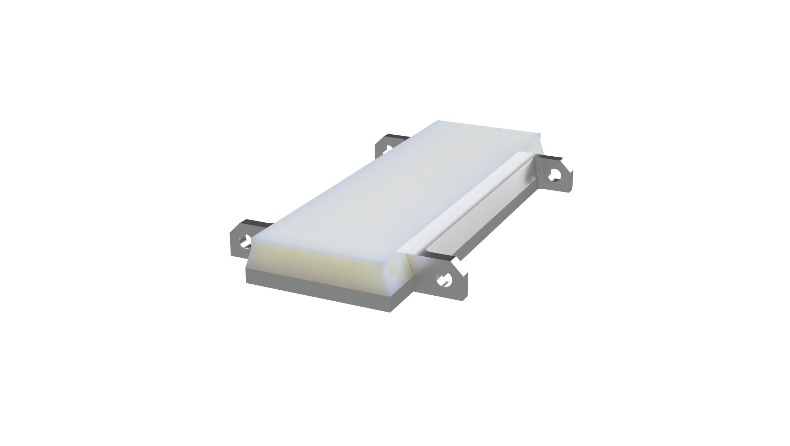

# Freeride Spacer

## Project Idea

The idea for this project started with inspiration from Cy Whitling,
in his blog post on his ultra-light [frankenbinding](https://www.powder.com/gear/so-you-want-to-mess-around-with-lighter-bindings)
made from a Ski Trab toe piece and an ATK heel.

Part of the key to Cy's success riding tiny bindings on much bigger (and more fun)
skis comes from the use of a freeride spacer, a simple block between the heel of
your boot and your ski, compensating for the lack of power transfer in the heel
of a tech binding.

Unfortunately, many people using DIY spacers are using static spacer, which introduce
a [significant](https://skimo.co/tech-binding-release-testing?srsltid=AfmBOooOls91-jaTQfPzKhw6q6DLAt5qXiUCXFwxqJonGi9njbTX2huG)
amount of friction into the binding release system, which could
significant increase the risk of a knee or leg injury.

While many people justify the use of a static spacer by positing that tech bindings
were never safe to begin with,
I think we ought to think about maximizing the tradeoff between safety and performance
in any individual design decision. As such, adding a sliding mechanism in the
free ride spacer is an obvious thing to do, and there is no scenario where you
can justify using a static one due to the low cost and effort involved in using
a sliding one.

This project aims to provide a simple open design for a free ride spacer which
anyone can order/build themselves, specced to their specific boot/binding combo.

One key feature of my spacer is having an ultra-low stack height of 6.5mm,
which is crucial for compatibility with ultra light tech bindings such
as the ATK hate route heel used here.

## Design Details

The design of the spacer is ridiculously simple and easy to manufacture.

There is a low profile aluminum base, which is mounted to the ski with two
M5 screws. These machine screws are not really meant to be drilled into wood,
but they are easily available, and not load bearing so it is fine for this
use.

Then on top sits a POM plastic piece, which offers a low friction
surface to slide on the polished aluminum base.

Finally, a simple elastic band holds the piece in the center, while allowing it to
slide out of the way in a release situation.

## Order instructions

Any CNC service can be used, but [JLC CNC](https://jlccnc.com/) is what I used, and tends to be the cheapest.

To order, first measure your stack height with your boot+ binding combo, and
then select the spacer file with a stack height greater than,
but closest to your measured height. It is fairly easy to sand down the plastic
spacer to get a perfect fit, but hard to add material later.

If you are handy with CAD software it should be easy to modify any of the spacer
files to get a perfect fit, note that the base adds 2.5mm on top of the height
of the spacer, which is accounted for in the file names, i.e. 6mm spacer = 2.5mm base + 4mm pad.

Then go to JLC CNC, or any other machining service, and upload the spacer.step file + the base.step file.

For the base use these settings, (make sure you add the drawing.pdf file below the roughness option!):

| Parameter | Value |
|-----------|-------|
| CNC file | base.step |
| Qty | 2 |
| Material | Aluminum 6061 |
| Surface Finish | No |
| Tightest Tolerance | ISO 2768 medium |
| Smallest Roughness | Ra1.6 |
| Threads | No |
| Sub-assembly | No |
| Product Desc | Aluminum Alloy Rectangular Plate |

For the spacer use these settings:
| Parameter | Value |
|-----------|-------|
| CNC file | spacer_(pick size).step |
| Qty | 2 |
| Material | POM(White) |
| Surface Finish | No |
| Tightest Tolerance | ISO 2768 medium |
| Smallest Roughness | Ra3.2 |
| Threads | No |
| Sub-assembly | No |
| Product Desc | Plastic Irregular Board |

Now you should be all set to order!

## Assembly

Each spacer uses 2x M5 flat head screws, and about 10cm of 2mm [shock cord](https://www.amazon.com/dp/B088QLQL27?ref=ppx_yo2ov_dt_b_fed_asin_title&th=1).

The spacers will likely not fit out of the box, as its hard to dial in the tolerances without ordering alot of different spacers, so just sand/scrape the sides until it slides with relativly low friction.

Then just measure and drill two holes (4.2mm), and screw in the base with epoxy/wood glue in the holes.
Finally, I would recommend applying some machine grease between the base and spacer to reduce icing and friction.

Now just insert the spacer and loop though the shock cord and tie it off. Now you should be ready to ski!

These bindings held up great for this icy and exposed decent of the south face of
Mt. Hood.

